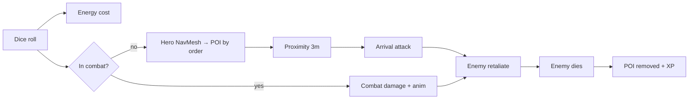

# FatesRoll

Unity 6 dice-driven exploration and combat prototype. Roll 2× d6, spend energy, walk Steve along the NavMesh toward POIs, and fight enemies when you reach them.

**Current version:** `v0.0.045` (see [`VERSION`](VERSION) and Unity **Player Settings → Version**).

| | |
|---|---|
| **Play scene** | `Assets/Scenes/main.unity` |
| **Unity** | 6000.x (binary-serialized scene) |
| **Repo** | https://github.com/czyzem-stack/fatesRoll |
| **Architecture** | [docs/ARCHITECTURE.md](docs/ARCHITECTURE.md) — diagrams & script index |

---

## Documentation

| Doc | Contents |
|-----|----------|
| [docs/ARCHITECTURE.md](docs/ARCHITECTURE.md) | Full architecture: system overview, combat, POI, dice, AI, UI, git hooks |
| This README | Quick start, layout, versioning, changelog, troubleshooting |

---

## Architecture (summary)

Detailed Mermaid diagrams live in **[docs/ARCHITECTURE.md](docs/ARCHITECTURE.md)**. Overview:



**Diagram index** (all in `docs/ARCHITECTURE.md`):

| # | Diagram |
|---|---------|
| 1 | System overview |
| 2 | Component dependency map |
| 3 | Singletons / scene objects |
| 4 | Core game loop (sequence) |
| 5 | Dice roll pipeline |
| 6 | Movement & POI order routing |
| 7 | Combat (arrival + in-combat + state) |
| 8 | Enemy AI state machine |
| 9 | POI lifecycle |
| 10 | Editor vs runtime POI setup |
| 11 | Stats & damage formulas (tables) |
| 12 | UI & health bars |
| 13 | Version / README git hooks |
| 14 | Script index |

---

## How to play (editor)

1. Open the project in Unity 6.
2. Open **`Assets/Scenes/main.unity`** (build index 0).
3. Press **Play**.
4. Roll dice (input / UI), watch energy, Steve walks based on the roll total toward the active POI.
5. Reach a POI to trigger combat (orc/slime/skeleton types via `POINode`).

---

## Core loop

```
Roll (energy) → dice settle → XP → walk toward POI (by order) → combat at POI → POI resolved → next order
```

| System | Script(s) | Notes |
|--------|-----------|--------|
| Dice | `DiceSpawner`, `DieResult` | Throw anim, settle, read values; combat vs explore branch |
| Movement | `HeroController` | NavMesh path; leftover steps → arrival damage |
| Energy | `EnergyManager` | Depletes on roll; regen timer; floating text |
| POIs | `POINode`, `POIManager` | `order` visit sequence; `POINodeEditor` builds visuals |
| Combat | `HeroController`, `Enemy` | Arrival hit + in-combat rolls; world-space HP bar |
| Stats | `PlayerStats`, `EnemyData` | RPG formulas; SO exists (runtime wiring TBD) |
| XP / level | `LevelManager` | XP from roll total; level-up animation |
| Tuning | `GlobalSettings` | Movement, energy, combat delay, XP curve |
| QA | `QADashboard`, `QAVersionDisplay` | Roll/distance debug; build version + git hash |

---

## Project layout

```
Assets/
  Scenes/main.unity          # Main game scene (use this, not SampleScene)
  Scripts/                   # Gameplay C# (no asmdef)
  Prefabs/UI/                # Health bar prefab (see POINodeEditor)
  Heroes/                    # Steve anims / controllers
  Dice/                      # Dice prefabs
docs/
  ARCHITECTURE.md            # Mermaid diagrams + technical reference
VERSION                      # Release label: v0.0.XXX
scripts/git-commit.ps1       # Commit with hooks (recommended)
scripts/bump-version.ps1     # Bump patch version only
scripts/update-readme.ps1    # Refresh README (run via commit-msg hook)
.githooks/                   # pre-commit: version; commit-msg: README
```

---

## Versioning

Patch versions use **`v0.0.XXX`** in `VERSION` and **`0.0.XXX`** in Unity.

**On each commit:** version and this changelog update automatically when hooks run.

Option A — wrapper (no global git config):

```powershell
.\scripts\git-commit.ps1 -m "Your commit message"
```

Option B — enable hooks for all commits in this repo:

```powershell
git config core.hooksPath .githooks
```

Or bump manually:

```powershell
.\scripts\bump-version.ps1
```

**Tagged restore points (GitHub):**

| Tag | Notes |
|-----|--------|
| `v0.0.016` | Basic combat + animation fixes |
| `v0.0.014` | Combat prep (DiceRoll anim) |
| `v0.0.013` | Pre-combat checkpoint |
| `v0.0.001` | Initial version tag |

Restore a tag:

```powershell
git fetch --tags
git checkout v0.0.016
```

---

## Git workflow (this project)

- **Commit** when a feature or stable slice works in Play mode.
- **Push** when you want GitHub backup.
- Always **save the scene** in Unity before committing (`main.unity` must be included for level/POI/combat wiring).
- Prefer **one logical change per commit**; version and README changelog update automatically when hooks are on.

**Do not commit** (usually): `Assets/_Recovery/`, `Library/`, `Temp/`, GUI pack reserialize-only prefab noise unless intentional.

---

## Changelog (high level)

Auto-updated on every commit when `.githooks` are enabled. Full history: `git log`.

<!-- CHANGELOG:BEGIN -->
| Version | Summary |
|---------|---------|
| **v0.0.045** | Sync README version and changelog for v0.0.044 |
| **v0.0.044** | Sync README version and changelog for v0.0.043 |
| **v0.0.043** | Tighten melee spacing, stabilize combat movement, and fix skeleton sword attack |
| **v0.0.041** | Sync README version and changelog for v0.0.040 |
| **v0.0.040** | Sync README version and changelog for v0.0.039 |
| **v0.0.039** | Sync README version and changelog for v0.0.038 |
| **v0.0.038** | Simplify combat engage and fix POI progression after kills |
| **v0.0.037** | Sync README version and changelog for v0.0.036 |
| **v0.0.036** | Add level-up celebration with full HP and energy restore |
| **v0.0.034** | Stabilize enemy animators and add isometric camera setup |
| **v0.0.031** | Sync README version and changelog to v0.0.030. |
| **v0.0.030** | Fix idle aggro spam and level-up animator on child rig. |
| **v0.0.029** | Sync README version and changelog for v0.0.028. |
| **v0.0.028** | Animation fixes for orc combat, movement, and facing. |
| **v0.0.027** | Sync README version and changelog after v0.0.026. |
| **v0.0.026** | Fix dice DieResult null checks and add architecture documentation. |
| **v0.0.025** | HP bar works and UI updated with critical fix. |
| **v0.0.021** | Combat works with stable hero and enemy animations. |
| **v0.0.020** | Foundation for massive combat overhaul - everything is set. |
| **v0.0.019** | Add HealthBar prefab on POI root canvas for all enemy types. |
| **v0.0.018** | Add git-commit wrapper so hooks run without global config. |
| **v0.0.017** | Solid state: scene + `IsDead` on hero/orc animators |
| **v0.0.016** | Basic combat working; hero & orc animation fixes |
| **v0.0.015** | Floating energy text, UI press effect, sticky POI target |
| **v0.0.014** | DiceRoll animation; combat prep |
| **v0.0.013** | Pre-combat checkpoint; version bump script fix |
| **v0.0.011+** | Energy burn on roll, regen, QA version display |
| **v0.0.001** | Project version baseline |
<!-- CHANGELOG:END -->

---

## Troubleshooting

| Issue | Check |
|-------|--------|
| Empty Hierarchy on `main.unity` | Unity 6 binary scene — reopen project, delete `Library/`, reimport; don’t swap scene files across old commits without care |
| Play opens wrong scene | **File → Build Settings** → `main.unity` at index 0 |
| Roll does nothing | Energy ≥ cost (`GlobalSettings.energyDepletionPerRoll`); Steve not already moving |
| No POI / no walk | Scene has `POINode` objects tagged `POI`; check `order` and Console for `HeroController` warnings |
| HP bar jitter / wrong layer | See [UI & health bars](docs/ARCHITECTURE.md#12-ui-and-health-bars) in architecture doc |

---

## License / assets

Third-party assets (Synty, GUI Pro-FantasyRPG, TextMesh Pro, etc.) remain under their respective licenses. Gameplay scripts in `Assets/Scripts/` are project-specific unless noted otherwise.
