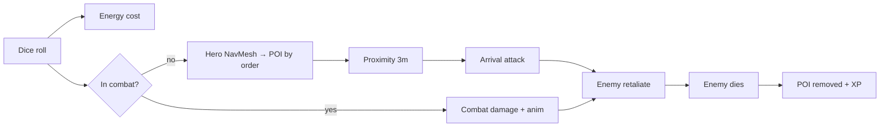

# FatesRoll

Unity 6 dice-driven exploration and combat prototype. Roll 2× d6, spend energy, walk Steve along the NavMesh toward POIs, and fight enemies when you reach them.

**Current version:** `v0.0.095` (see [`VERSION`](VERSION) and Unity **Player Settings → Version**).

| | |
|---|---|
| **Play scene** | `Assets/Scenes/main.unity` |
| **Unity** | 6000.x (binary-serialized scene) |
| **Repo** | https://github.com/czyzem-stack/fatesRoll |
| **Architecture** | [docs/ARCHITECTURE.md](docs/ARCHITECTURE.md) — diagrams & script index |

---

## Documentation

| Doc | Contents |
|-----|----------|
| [docs/ARCHITECTURE.md](docs/ARCHITECTURE.md) | Full architecture: system overview, combat, POI, dice, AI, UI, git hooks |
| This README | Quick start, layout, versioning, changelog, troubleshooting |

---

## Architecture (summary)

Detailed Mermaid diagrams live in **[docs/ARCHITECTURE.md](docs/ARCHITECTURE.md)**. Overview:



**Diagram index** (all in `docs/ARCHITECTURE.md`):

| # | Diagram |
|---|---------|
| 1 | System overview |
| 2 | Component dependency map |
| 3 | Singletons / scene objects |
| 4 | Core game loop (sequence) |
| 5 | Dice roll pipeline |
| 6 | Movement & POI order routing |
| 7 | Combat (arrival + in-combat + state) |
| 8 | Enemy AI state machine |
| 9 | POI lifecycle |
| 10 | Editor vs runtime POI setup |
| 11 | Stats & damage formulas (tables) |
| 12 | UI & health bars |
| 13 | Version / README git hooks |
| 14 | Script index |

---

## How to play (editor)

1. Open the project in Unity 6.
2. Open **`Assets/Scenes/main.unity`** (build index 0).
3. Press **Play**.
4. Roll dice (input / UI), watch energy, Steve walks based on the roll total toward the active POI.
5. Reach a POI to trigger combat (orc/slime/skeleton types via `POINode`).

---

## Core loop

```
Roll (energy) → dice settle → XP → walk toward POI (by order) → combat at POI → POI resolved → next order
```

| System | Script(s) | Notes |
|--------|-----------|--------|
| Dice | `DiceSpawner`, `DieResult` | Throw anim, settle, read values; combat vs explore branch |
| Movement | `HeroController` | NavMesh path; leftover steps → arrival damage |
| Energy | `EnergyManager` | Depletes on roll; regen timer; floating text |
| POIs | `POINode`, `POIManager` | `order` visit sequence; `POINodeEditor` builds visuals |
| Combat | `HeroController`, `Enemy` | Arrival hit + in-combat rolls; world-space HP bar |
| Stats | `PlayerStats`, `EnemyData` | RPG formulas; SO exists (runtime wiring TBD) |
| XP / level | `LevelManager` | XP from roll total; level-up animation |
| Tuning | `GlobalSettings` | Movement, energy, melee spacing/timing, XP; `combatLogEnabled`, `verboseGameplayLogs`, `showPath` |
| Steve / enemy stats | `PlayerStats`, `Enemy` | HP, damage, crit, dodge (not on GlobalSettings) |
| QA | `QADashboard`, `QAVersionDisplay` | Roll/distance debug; build version + git hash |

---

## Project layout

```
Assets/
  Scenes/main.unity          # Main game scene (use this, not SampleScene)
  Scripts/                   # Gameplay C# (no asmdef)
  Prefabs/UI/                # Health bar prefab (see POINodeEditor)
  Heroes/                    # Steve anims / controllers
  Dice/                      # Dice prefabs
docs/
  ARCHITECTURE.md            # Mermaid diagrams + technical reference
VERSION                      # Release label: v0.0.XXX
scripts/git-commit.ps1       # Commit with hooks (recommended)
scripts/bump-version.ps1     # Bump patch version only
scripts/update-readme.ps1    # Refresh README (run via commit-msg hook)
.githooks/                   # pre-commit: version; commit-msg: README
```

---

## Versioning

Patch versions use **`v0.0.XXX`** in `VERSION` and **`0.0.XXX`** in Unity.

**On each commit:** version and this changelog update automatically when hooks run.

Option A — wrapper (no global git config):

```powershell
.\scripts\git-commit.ps1 -m "Your commit message"
```

Option B — enable hooks for all commits in this repo:

```powershell
git config core.hooksPath .githooks
```

Or bump manually:

```powershell
.\scripts\bump-version.ps1
```

**Tagged restore points (GitHub):**

| Tag | Notes |
|-----|--------|
| `v0.0.016` | Basic combat + animation fixes |
| `v0.0.014` | Combat prep (DiceRoll anim) |
| `v0.0.013` | Pre-combat checkpoint |
| `v0.0.001` | Initial version tag |

Restore a tag:

```powershell
git fetch --tags
git checkout v0.0.016
```

---

## Git workflow (this project)

- **Commit** when a feature or stable slice works in Play mode.
- **Push** when you want GitHub backup.
- Always **save the scene** in Unity before committing (`main.unity` must be included for level/POI/combat wiring).
- Prefer **one logical change per commit**; version and README changelog update automatically when hooks are on.

**Do not commit** (usually): `Assets/_Recovery/`, `Library/`, `Temp/`, GUI pack reserialize-only prefab noise unless intentional.

---

## Changelog (high level)

Auto-updated on every commit when `.githooks` are enabled. Full history: `git log`.

<!-- CHANGELOG:BEGIN -->
| Version | Summary |
|---------|---------|
| **v0.0.095** | Fix dice roll hitch, safe QuestManager inspector, and bootstrap quest setup |
| **v0.0.094** | Null-safe mission and talent panel actions via GameServices |
| **v0.0.093** | QuestManager on bootstrap; persist quests, talents, and gear through Steve death |
| **v0.0.092** | Require bootstrap RunDeathController and fix upgrade alert badge count |
| **v0.0.091** | Fix roll input in builds and apply energy talent to max energy |
| **v0.0.090** | All main UI panels implemented |
| **v0.0.089** | Inventory planned and hooked in UI, non-functional placeholder |
| **v0.0.088** | Prepare for loot: missions QA'd and optimized until reward loot ships |
| **v0.0.087** | Shop UI works: panel resources, global HUD toggle, and main scene wiring |
| **v0.0.086** | Added hero select panel with gems and heroes UI |
| **v0.0.085** | Power score formula update and register TalentManager in GameServices |
| **v0.0.084** | Working stable build: talent upgrades, power score delta feedback, unpolished but playable |
| **v0.0.083** | Bug resolution for upgrades: affordable upgrade count and alert badge |
| **v0.0.082** | Talent tree is in |
| **v0.0.081** | Set up to implement talent tree: Profile HUD paths, panel toggle, and shop UI |
| **v0.0.080** | HP and XP bar smoothing with corrected Profile HUD slider paths |
| **v0.0.079** | UI foundation QAed: new home screen |
| **v0.0.078** | Save point: character panel prefab state at stable break boundary |
| **v0.0.077** | Orc battle shout buff, configurable special floating text, and fear miss labels |
| **v0.0.076** | Add EnemySpecialController, Bat animator, and tunable skeleton block and bat fear |
| **v0.0.075** | Relocate Steve and Orc animators, add skeleton block and protected attack recovery windows |
| **v0.0.074** | Equipment-driven hero stance animators and synced weapon animator controllers |
| **v0.0.073** | Sync animator controllers and wire Taunt, GetHit, and InCombat parameters |
| **v0.0.072** | Add GameConstants, shared crit helpers, and service coroutine cleanup on destroy |
| **v0.0.071** | Remove unused health slider cache fields and update main scene |
| **v0.0.070** | Reduce health bar UI churn, gate spawn logs, and harden combat dice flow |
| **v0.0.069** | Fix visit POIs vs spawns, combat engage, SpawnManager probe, DDOL HUD rebind |
| **v0.0.068** | Add Bootstrap scene flow, restore main gameplay markers, and fix dice/camera follow |
| **v0.0.067** | Defer heavy bootstrap to next frame and harden domain reload resets |
| **v0.0.066** | Polish GameServices hero registration, IsInitialized, and manager docs |
<!-- CHANGELOG:END -->

---

## Troubleshooting

| Issue | Check |
|-------|--------|
| Empty Hierarchy on `main.unity` | Unity 6 binary scene — reopen project, delete `Library/`, reimport; don’t swap scene files across old commits without care |
| Play opens wrong scene | **File → Build Settings** → `main.unity` at index 0 |
| Roll does nothing | Energy ≥ cost (`GlobalSettings.energyDepletionPerRoll`); Steve not already moving |
| No POI / no walk | Scene has `POINode` objects tagged `POI`; check `order` and Console for `HeroController` warnings |
| HP bar jitter / wrong layer | See [UI & health bars](docs/ARCHITECTURE.md#12-ui-and-health-bars) in architecture doc |

---

## License / assets

Third-party assets (Synty, GUI Pro-FantasyRPG, TextMesh Pro, etc.) remain under their respective licenses. Gameplay scripts in `Assets/Scripts/` are project-specific unless noted otherwise.
