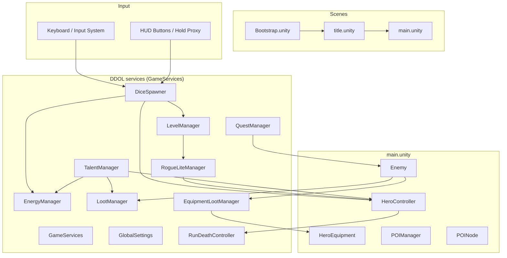
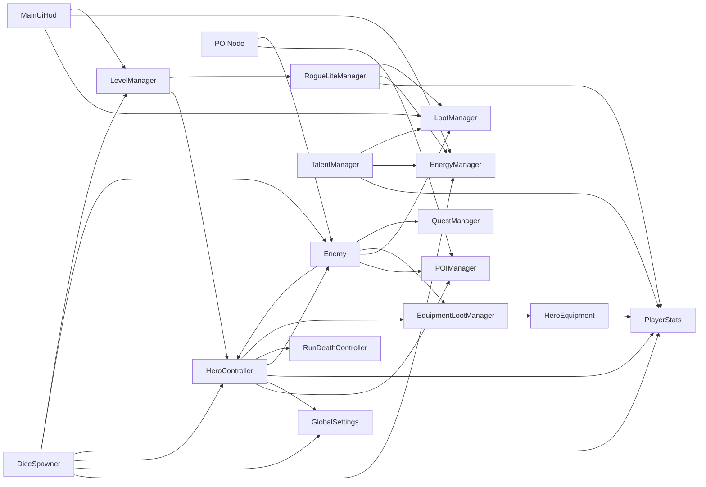
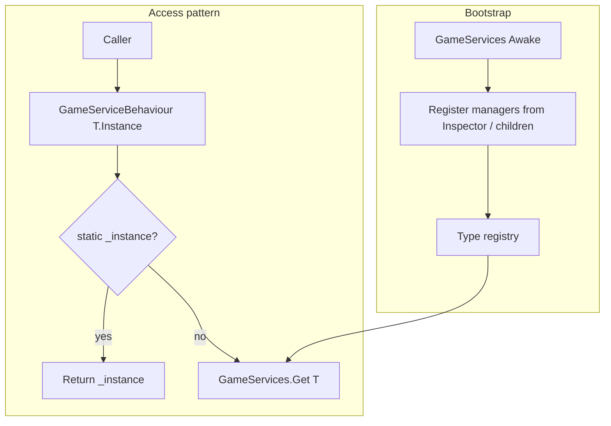
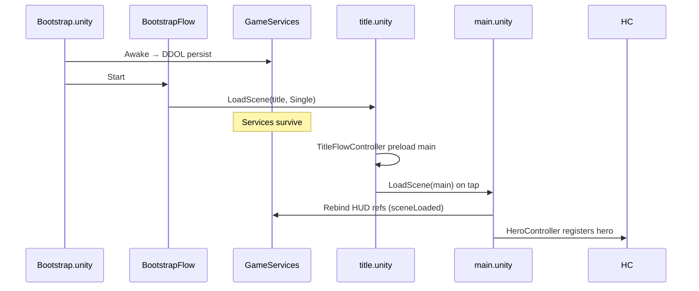
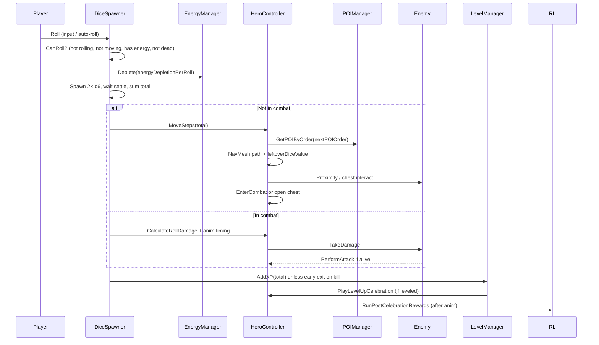
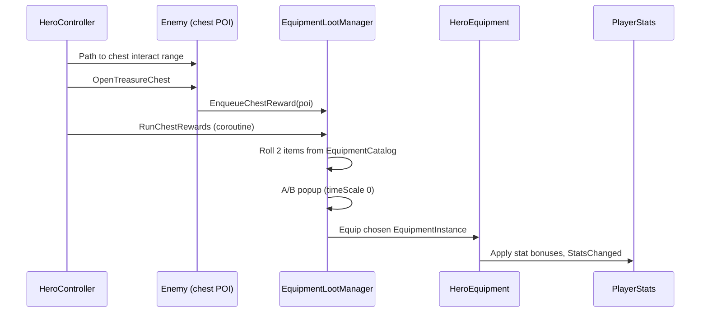

# FatesRoll — Architecture

Technical reference for the Unity 6 prototype. **Play flow:** `Bootstrap.unity` → `title.unity` → `main.unity`. Services live on the bootstrap object (DDOL); gameplay lives in `main`.

---

## Table of contents

1. [System overview](#1-system-overview)
2. [Component map](#2-component-map)
3. [Singletons and bootstrap](#3-singletons-and-bootstrap)
4. [Bootstrap and scene flow](#4-bootstrap-and-scene-flow)
5. [Core game loop](#5-core-game-loop)
6. [Dice roll pipeline](#6-dice-roll-pipeline)
7. [Movement and POI routing](#7-movement-and-poi-routing)
8. [Combat flows](#8-combat-flows)
9. [Enemy AI](#9-enemy-ai)
10. [POI lifecycle](#10-poi-lifecycle)
11. [Editor vs runtime (POI setup)](#11-editor-vs-runtime-poi-setup)
12. [Stats and damage formulas](#12-stats-and-damage-formulas)
13. [UI and HUD](#13-ui-and-hud)
14. [Title scene and level-up rewards](#14-title-scene-and-level-up-rewards)
15. [Meta progression (quests, talents, death)](#15-meta-progression-quests-talents-death)
16. [Equipment and loot](#16-equipment-and-loot)
17. [Repo, version, and README automation](#17-repo-version-and-readme-automation)
18. [Editor menus](#18-editor-menus)
19. [Script index](#19-script-index)

---

## 1. System overview

Input drives dice; dice drives movement or combat; POIs host enemies and treasure chests; bootstrap managers coordinate services across scene loads.

---

## 2. Component map

Runtime dependencies (simplified).

---

## 3. Singletons and bootstrap

Gameplay services use **`GameServices`** (`DefaultExecutionOrder -10000`) plus **`GameServiceBehaviour<T>`** — no `FindAnyObjectByType` in `Instance` getters.

**Scene setup:** **FatesRoll → Setup → Add Game Services Bootstrap** (or open `Bootstrap.unity`). One `GameServices` root with manager children; enable **Persist Across Scenes**. Steve registers via `GameServices.RegisterHero(this)` in `HeroController.Awake` (and again in `Start` if bootstrap order was late).

**Access patterns**

| API | Behavior |
|-----|----------|
| `GameServices.Hero` / `HeroController` | Steve; null-safe, purges stale refs |
| `GameServices.IsInitialized` | Bootstrap finished Awake |
| `GameServices.Get<T>()` | Throws if missing (strict) |
| `GameServices.TryGet<T>(out T)` | Null-safe |
| `Foo.Instance` / `HasInstance` | Null-safe via registry |

**Domain reload:** `GameServices` clears `Current` on `SubsystemRegistration` and `BeforeSceneLoad`.

**Startup cost:** Awake only sets `Current` and DDOL; child discovery runs next frame (`deferHeavyBootstrap`). Bootstrap `[GameServices]` logs are gated by `GlobalSettings.verboseGameplayLogs` (off by default). Missing required services still log warnings once.

| Component | Pattern | Notes |
|-----------|---------|--------|
| `GameServices` | Bootstrap registry | Inspector refs + optional `GetComponentInChildren` on bootstrap root |
| `GlobalSettings` | `GameServiceBehaviour` + DDOL | Movement, energy, combat delays, XP curve, log toggles |
| `DiceSpawner` | `GameServiceBehaviour` | Roll orchestration; input from Resources or Inspector |
| `EnergyManager` | `GameServiceBehaviour` | Pool, regen, HUD; `AddMaxEnergyBonus()` for talents |
| `POIManager` | `GameServiceBehaviour` | Active `POINode` registry |
| `SpawnManager` | `GameServiceBehaviour` | Encounter spawning; reset on death |
| `LevelManager` | `GameServiceBehaviour` | XP bar; `ProgressChanged` event |
| `RogueLiteManager` | `GameServiceBehaviour` | Post–level-up A/B stat popup |
| `LootManager` | `GameServiceBehaviour` | Coin celebration drops; `BalanceChanged` event |
| `EquipmentLootManager` | `GameServiceBehaviour` | Treasure chest A/B equipment popup |
| `TalentManager` | `GameServiceBehaviour` | Gold-paid random upgrades; `Upgraded` event |
| `QuestManager` | `GameServiceBehaviour` | Kill quests + achievements; child of bootstrap |
| `RunDeathController` | `GameServiceBehaviour` | Death fade, respawn, world reset |
| `EnemyStatManager` | `GameServiceBehaviour` | Run difficulty scaling |
| `HeroController` | Scene component on Steve | Movement, combat, chest travel |
| `HeroEquipment` | Scene component on Steve | Modular rig visuals + stat bonuses |

**Do not** duplicate managers under `main.unity`. Use **FatesRoll → Setup → Remove Duplicate Bootstrap From Main Scene** if copies appear after merges.

---

## 4. Bootstrap and scene flow

| Scene | Build index | Role |
|-------|-------------|------|
| `Assets/Scenes/Bootstrap.unity` | 0 | DDOL `GameServices`, `BootstrapFlow` → loads title |
| `Assets/Scenes/title.unity` | 1 | Loading bar, tap to start, async preload of main |
| `Assets/Scenes/main.unity` | 2 | Gameplay world, Steve, POIs, MainUI |

**Always test:** Play from **Bootstrap** (or use **FatesRoll → Scenes → Set Play Mode Start To Bootstrap**). Playing `main.unity` directly skips bootstrap and breaks service wiring.

**Camera:** Cinemachine virtual camera + `IsometricCameraControl` (scroll zoom). Legacy `CameraFollow` is an obsolete empty stub — remove via **FatesRoll → Cleanup → Remove Obsolete Camera Follow In Main Scene**.

---

## 5. Core game loop

One turn from the player’s perspective.

---

## 6. Dice roll pipeline

**`CanRoll()` gates**

| Check | Blocks roll when |
|--------|-------------------|
| `isRolling` | Already in `RollRoutine` |
| `hero.IsMoving` | NavMesh walk in progress |
| Energy | `currentEnergy < energyDepletionPerRoll` |
| Death / chest popup | `RunDeathController.IsDeathInProgress` or equipment reward flow active |

*Note:* `InCombat` does **not** block rolling (combat rolls are intentional).

Roll input: assign `InputSystem_Actions` on `DiceSpawner` or rely on `Assets/Resources/InputSystem_Actions.inputactions` for builds.

---

## 7. Movement and POI routing

Ordered POI visits (`POINode.order`).

**`GetPOIByOrder(order)` logic**

1. Return first POI with `poi.order == order`.
2. Else return POI with smallest `poi.order > order`.
3. Else `null` (no walk).

Treasure chest POIs: Steve paths to chest interact range; `Enemy.OpenTreasureChest()` enqueues equipment rewards (no combat).

---

## 8. Combat flows

Two entry paths share animation timing; dice combat uses `HeroController.CalculateRollDamage` (`AttackDamage × roll/7` + crit).

**Crit:** `CombatLog.RollAndApplyCrit` rolls once; combat logs show the same d100 used for the hit.

**Arrival combat** — triggered when Steve reaches POI engage range.  
**In-combat dice attack** — triggered from `DiceSpawner` when `hero.InCombat`.

---

## 9. Enemy AI

`Enemy.HandleAI()` each frame while alive: patrol → taunt → chase → engaged. Steve initiates melee; enemies do not aggro from arbitrary distance beyond chase rules.

---

## 10. POI lifecycle

Editor: `POINodeEditor` builds monster prefab + health bar under POI root.  
Runtime: `POINode.Start` → register → `Enemy.Initialize`.  
Death: `Enemy.Die` → coin loot → quest progress → `ExitCombat` → delayed `POIManager.ResolvePOI`.

---

## 11. Editor vs runtime (POI setup)

| Concern | Editor | Play mode |
|---------|--------|-----------|
| Monster mesh | `POINodeEditor` spawns prefab | Already in scene |
| Health bar | Editor positions at +2.8y | `LateUpdate` billboards |
| Stats | `Enemy` inspector / `EnemyData` SO | `Initialize()` |

---

## 12. Stats and damage formulas

| Derived stat | Formula |
|--------------|---------|
| maxHP | `vitality × 10 + 100` (+ talent) |
| attackDamage | `strength × 4 + 20` |
| critChance (%) | `luck × 0.8` (+ talent) |
| critDamage (%) | `50 + luck × 1.5` (+ talent) |
| dodgeChance (%) | `agility × 0.6` (+ talent) |

**Where to tune**

| What | Component |
|------|-----------|
| Steve stats | `PlayerStats` on Steve |
| Enemy stats | `Enemy` / `EnemyData` on POI |
| Melee engage, combat delays | `GlobalSettings` |
| Combat console | `GlobalSettings.combatLogEnabled` |
| Dice / movement / XP logs | `GlobalSettings.verboseGameplayLogs` |

---

## 13. UI and HUD

**`MainUiHud`** — static dual-path lookups for GUI Pro layout variants (`MainUI_Canvas/Resources` vs `HUD_Resources`, etc.). Managers call `MainUiHud.FindComponentAlongPaths<T>(...)` in `AutoAssignUI()` and on `sceneLoaded`.

**Event-driven meta UI** (no per-frame polling in panels):

| Event | Source | Typical subscribers |
|-------|--------|---------------------|
| `LootManager.BalanceChanged` | Gold/gem spend or pickup | Talent, Shop, Mission, Heroes, upgrade badge |
| `LevelManager.ProgressChanged` | XP / level | Talent, Heroes |
| `TalentManager.Upgraded` | Paid upgrade | Talent UI, upgrade badge |
| `PlayerStats.StatsChanged` | Derived stat recalc | Power score |
| `QuestManager.OnQuestsUpdated` | Quest progress / claim | Mission panel, top quest HUD |

**Mission scroll:** content under `ScrollRect/Viewport/Content`. Legacy typo `Veiwport` still resolved as fallback; fix via **FatesRoll → Setup → Fix Scroll Viewport Typo In Main Scene**.

**Enemy HUD:** world-space slider on POI root, billboard in `Enemy.LateUpdate`.

---

## 14. Title scene and level-up rewards

`TitleFlowController`: loading UI → async preload main (`allowSceneActivation = false`) → tap activates main.

After level-up celebration, `RogueLiteManager` shows A/B stat pick (timeScale 0). Energy regen and bonus coins per kill stack via `RogueLiteManager` modifiers on `EnergyManager` / `LootManager`.

---

## 15. Meta progression (quests, talents, death)

### 15.1 Session persistence (prototype)

**No disk save / PlayerPrefs** in current prototype. On Steve death, **these persist for the session:**

| Persists | Resets on death |
|----------|-----------------|
| Gold, gems | Enemy run scaling (`EnemyStatManager`) |
| Talent levels + bonuses | Spawn encounters |
| Active quests + progress | POI enemy refresh |
| Equipped gear (visuals + stats) | Steve position → spawn |

`RunDeathController`: fade out → reset world difficulty → respawn Steve → fade in → stand-up → `HeroEquipment.ReapplyEquippedVisuals()`.

`RunDeathController` must live on **bootstrap only** (not runtime-spawned).

### 15.2 Quests

`QuestManager` on bootstrap (`EnsureQuestManagerOnBootstrap` if missing). Kill quests track `POIType` targets; UI via `MissionPanelUI`, `MissionItemUI`, `TopQuestDisplay`. Setup: **FatesRoll → Setup → Ensure QuestManager On Bootstrap**.

### 15.3 Talents

`TalentManager.PerformUpgrade()` spends gold, picks random category (HP, stats, dodge, crit, energy, coin gain). Energy uses `EnergyManager.AddMaxEnergyBonus()`; coin gain uses `LootManager.AddGoldPerCoinBonus()` (does not mutate serialized `goldPerCoin`).

---

## 16. Equipment and loot

### 16.1 Coin loot (live)

`LootManager.OnEnemyDied`: firework burst → ground linger → Steve pickup → batch gold grant.  
Effective gold per coin: `LootManager.GetGoldPerCoin()` = base + talent bonus + rogue-lite kill bonus (drop count).

### 16.2 Equipment loot (live — chest flow)

**Data**

| Asset / type | Role |
|--------------|------|
| `EquipmentCatalog` | Pools of `EquipmentItemDefinition` by slot/category |
| `EquipmentItemDefinition` | Prefab id, slot, chest category, stat weights |
| `EquipmentInstance` | Rolled item + 2-of-4 stat bonuses |
| `EquipmentSlotType` | MainHand, OffHand, head sub-slots, body, cape, rings, etc. |

**`HeroEquipment`** on Steve: resolves MC02 rig sockets, toggles body/head variants, spawns weapon prefabs, applies stat-only slots.

### 16.3 Inventory UI (planned — next major feature)

| Status | Item |
|--------|------|
| Done | Chest drop + equip onto Steve, celebration coin loot, equipment stats |
| Done | Equipment panel prefab in scene (GUI Pro demo layout) |
| **TODO** | Functional inventory grid (owned items, not just equipped) |
| **TODO** | Equip/unequip from UI, compare tooltips |
| **TODO** | FTUE chest drops, naked Steve default loadout |
| **TODO** | QA pass on slot conflicts (head layers, body toggles) |

When adding inventory, prefer extending `HeroEquipment` + a new `InventoryManager` service on bootstrap rather than scene `Find` from UI `Update()`.

---

## 17. Repo, version, and README automation

| Path | Role |
|------|------|
| `VERSION` | `v0.0.XXX` tag string |
| `scripts/git-commit.ps1` | Commit with `.githooks` |
| `scripts/bump-version.ps1` | Pre-commit patch bump |
| `scripts/update-readme.ps1` | Commit-msg README changelog row |

First line of commit message becomes the README changelog summary for that version.

---

## 18. Editor menus

| Menu | Purpose |
|------|---------|
| **FatesRoll → Setup → Add Game Services Bootstrap** | Create `Bootstrap.unity` + wire managers |
| **FatesRoll → Setup → Ensure QuestManager On Bootstrap** | Reparent/create `QuestManager` |
| **FatesRoll → Setup → Fix Scroll Viewport Typo In Main Scene** | Safe ScrollRect rename (do not text-edit binary scenes) |
| **FatesRoll → Setup → Remove Duplicate Bootstrap From Main Scene** | Strip copied managers from main |
| **FatesRoll → Cleanup → Remove Missing Scripts In Main Scene** | Strip broken script refs |
| **FatesRoll → Cleanup → Remove Obsolete Camera Follow In Main Scene** | Remove legacy camera component |
| **FatesRoll → Scenes → Set Play Mode Start To Bootstrap** | Correct play-test entry |
| **FatesRoll → Scenes → Setup Title Loading Scene** | Title flow + build order |

---

## 19. Script index

| Script | Responsibility |
|--------|----------------|
| `GameServices` | DDOL bootstrap registry; hero registration |
| `GameServiceBehaviour<T>` | Manager base — registers in Awake |
| `BootstrapFlow` | Bootstrap → load title |
| `GlobalSettings` | Tuning singleton; log gates |
| `DiceSpawner` | Input, roll physics, move vs combat branch |
| `DieResult` | Dice face value + settled detection |
| `HeroController` | NavMesh, POI/chest routing, combat, death hook |
| `SteveMovement` / `SteveAnimator` | Locomotion + animation helpers |
| `PlayerStats` | Hero stats, dodge, `StatsChanged` |
| `HeroEquipment` | Modular equip visuals + bonuses |
| `Enemy` | AI, combat, HP bar, chest + coin death hooks |
| `EnemyData` | ScriptableObject stat template for POI |
| `POINode` / `POIManager` | POI registry, order, resolve |
| `SpawnManager` / `SpawnNode` | Encounter spawning |
| `EnergyManager` | Energy pool, regen, talent max bonus API |
| `LevelManager` | XP, level UI, `ProgressChanged` |
| `LootManager` | Coin celebration, gold HUD, `GetGoldPerCoin()` |
| `DroppedCoin` | Coin arc, pickup fly-to Steve |
| `EquipmentLootManager` | Chest A/B equipment popup |
| `EquipmentCatalog` / `EquipmentItemDefinition` / `EquipmentInstance` | Gear data |
| `RogueLiteManager` | Level-up A/B stat rewards |
| `TalentManager` | Gold upgrades, `Upgraded` event |
| `QuestManager` | Quests + achievements |
| `RunDeathController` | Death fade, respawn, session-persistent meta |
| `EnemyStatManager` / `EnemySpecialController` | Run scaling, specials |
| `MainUiHud` | HUD path lookups, mission scroll content |
| `MissionPanelUI` / `MissionItemUI` / `TopQuestDisplay` | Quest UI |
| `TalentUIController` / `UpgradeAlertController` | Talent shop + badge |
| `CombatLog` | Unified combat logging + crit roll |
| `IsometricCameraControl` | Cinemachine zoom |
| `TitleFlowController` | Title → main loading flow |
| `PersistenceUtility` | DDOL helper |
| `CameraFollow` | **Obsolete stub** — remove from scenes |
| `HeroWeaponStance` | **Obsolete stub** — remove from Steve |

---

## Related docs

- [README.md](../README.md) — setup, play instructions, changelog, troubleshooting
- [VERSION](../VERSION) — current patch label
