# FatesRoll — Architecture

Technical reference for **v0.0.025** (`main`, play scene `Assets/Scenes/main.unity`).

---

## Table of contents

1. [System overview](#1-system-overview)
2. [Component map](#2-component-map)
3. [Singletons and scene objects](#3-singletons-and-scene-objects)
4. [Core game loop](#4-core-game-loop)
5. [Dice roll pipeline](#5-dice-roll-pipeline)
6. [Movement and POI routing](#6-movement-and-poi-routing)
7. [Combat flows](#7-combat-flows)
8. [Enemy AI](#8-enemy-ai)
9. [POI lifecycle](#9-poi-lifecycle)
10. [Editor vs runtime (POI setup)](#10-editor-vs-runtime-poi-setup)
11. [Stats and damage formulas](#11-stats-and-damage-formulas)
12. [UI and health bars](#12-ui-and-health-bars)
13. [Repo, version, and README automation](#13-repo-version-and-readme-automation)
14. [Script index](#14-script-index)

---

## 1. System overview

High-level view: input drives dice; dice drives movement or combat; POIs host enemies; managers coordinate targets and cleanup.

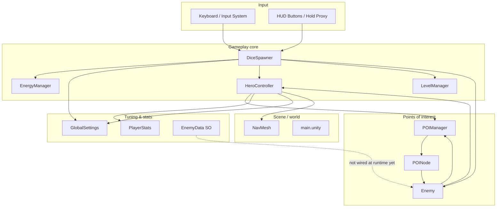

---

## 2. Component map

Who talks to whom (runtime dependencies).

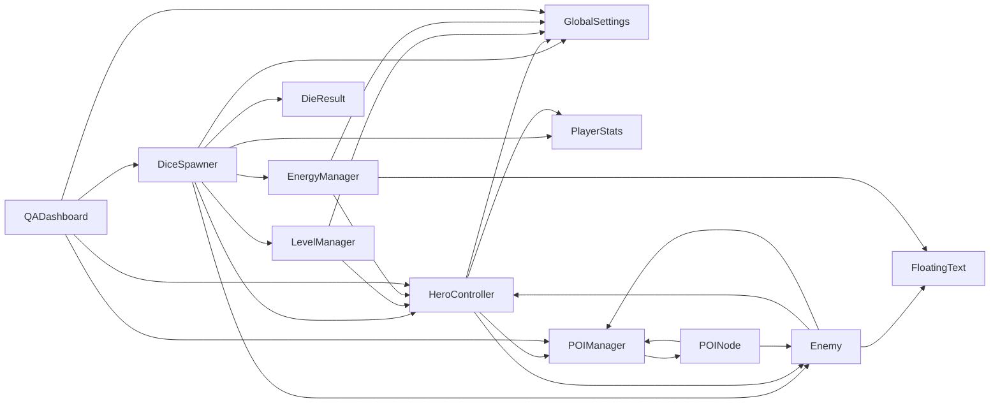

---

## 3. Singletons and scene objects

Lazy singletons via `FindAnyObjectByType` (created at runtime if missing for some types).

```mermaid
flowchart TD
    subgraph Access pattern
        A[Caller] --> B{Instance null?}
        B -->|yes| C[FindAnyObjectByType]
        B -->|no| D[Return cached _instance]
        C --> E[Optional: new GameObject + AddComponent]
    end

    subgraph Managers
        GS[GlobalSettings<br/>DontDestroyOnLoad]
        EM[EnergyManager]
        PM[POIManager]
        LM[LevelManager]
    end

    subgraph Scene actors
        HC[HeroController on Steve]
        DS[DiceSpawner in scene]
        PN1[POINode + Enemy ...]
        PN2[POINode + Enemy ...]
    end

    GS --- Access pattern
    EM --- Access pattern
    PM --- Access pattern
    LM --- Access pattern
```

| Component | Pattern | Notes |
|-----------|---------|--------|
| `GlobalSettings` | Singleton + `DontDestroyOnLoad` | Movement, energy, combat delays, XP curve |
| `EnergyManager` | Singleton | Current energy, regen timer, HUD text |
| `POIManager` | Singleton | Registry of active `POINode`s |
| `LevelManager` | Singleton | XP bar, level-up |
| `HeroController` | Scene component | One hero (Steve) |
| `DiceSpawner` | Scene component | Roll orchestration |

---

## 4. Core game loop

One turn from the player’s perspective.

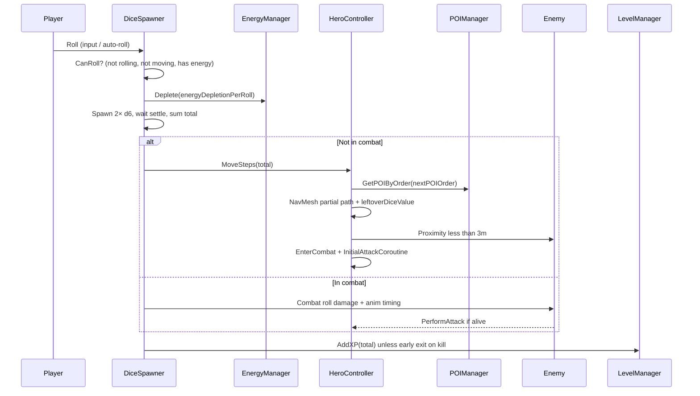

---

## 5. Dice roll pipeline

Detailed `RollRoutine` coroutine.

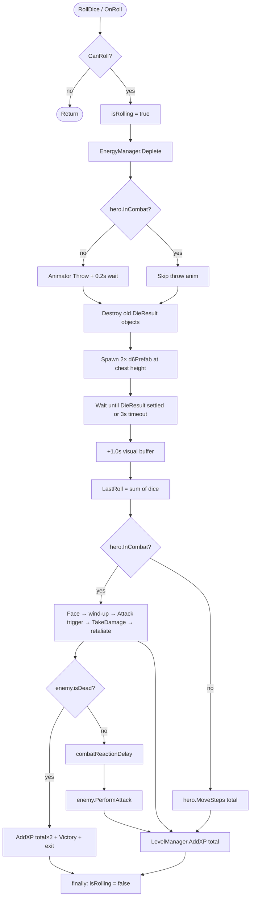

**`CanRoll()` gates**

| Check | Blocks roll when |
|--------|-------------------|
| `isRolling` | Already in `RollRoutine` |
| `hero.IsMoving` | NavMesh walk in progress |
| Energy | `currentEnergy < energyDepletionPerRoll` |

*Note:* `InCombat` does **not** block rolling (combat rolls are intentional).

---

## 6. Movement and POI routing

Ordered POI visits (`POINode.order`) replaced random-only targeting in v0.0.025+.

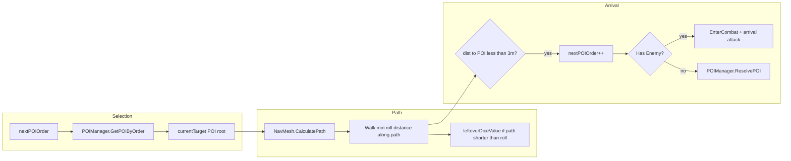

**`GetPOIByOrder(order)` logic**

1. Return first POI with `poi.order == order`.
2. Else return POI with smallest `poi.order > order`.
3. Else `null` (no walk).

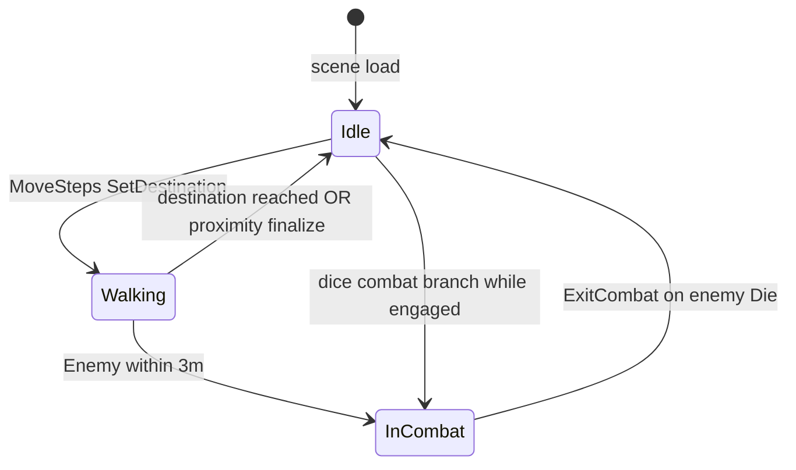

---

## 7. Combat flows

Two entry paths share similar animation timing but different damage formulas.

### 7.1 Arrival combat (first hit)

Triggered from `HeroController` when Steve reaches POI range.

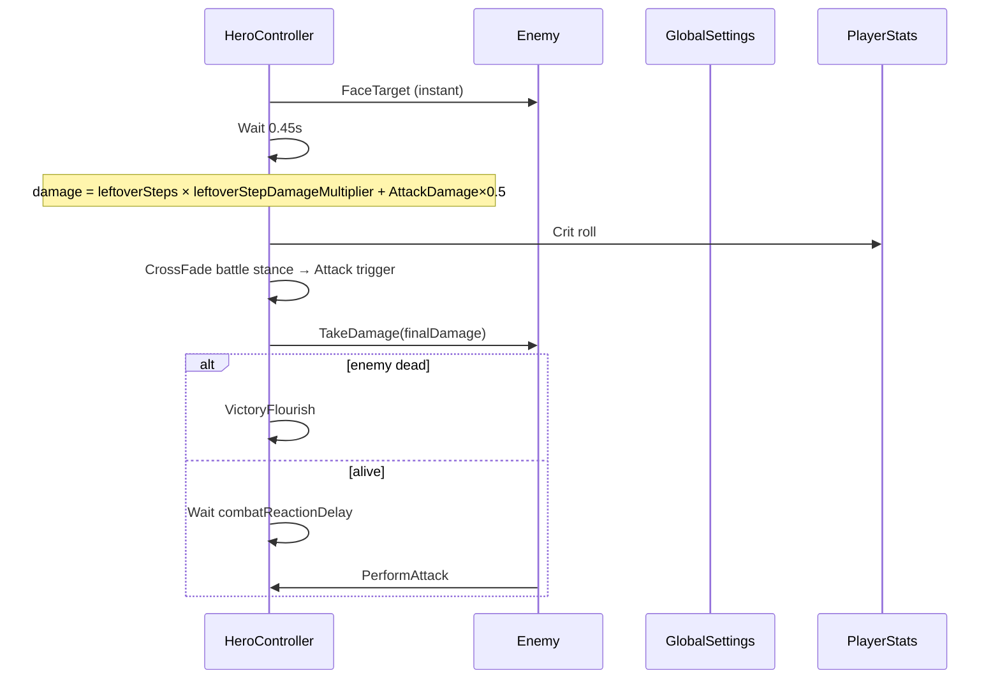

### 7.2 In-combat dice attack

Triggered from `DiceSpawner` when `hero.InCombat`.

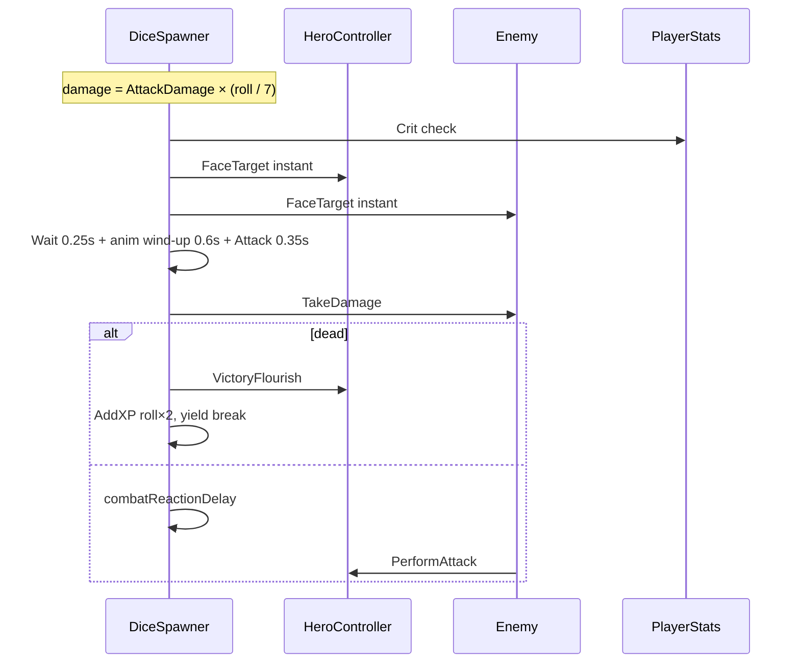

### 7.3 Combat state (hero + enemy)

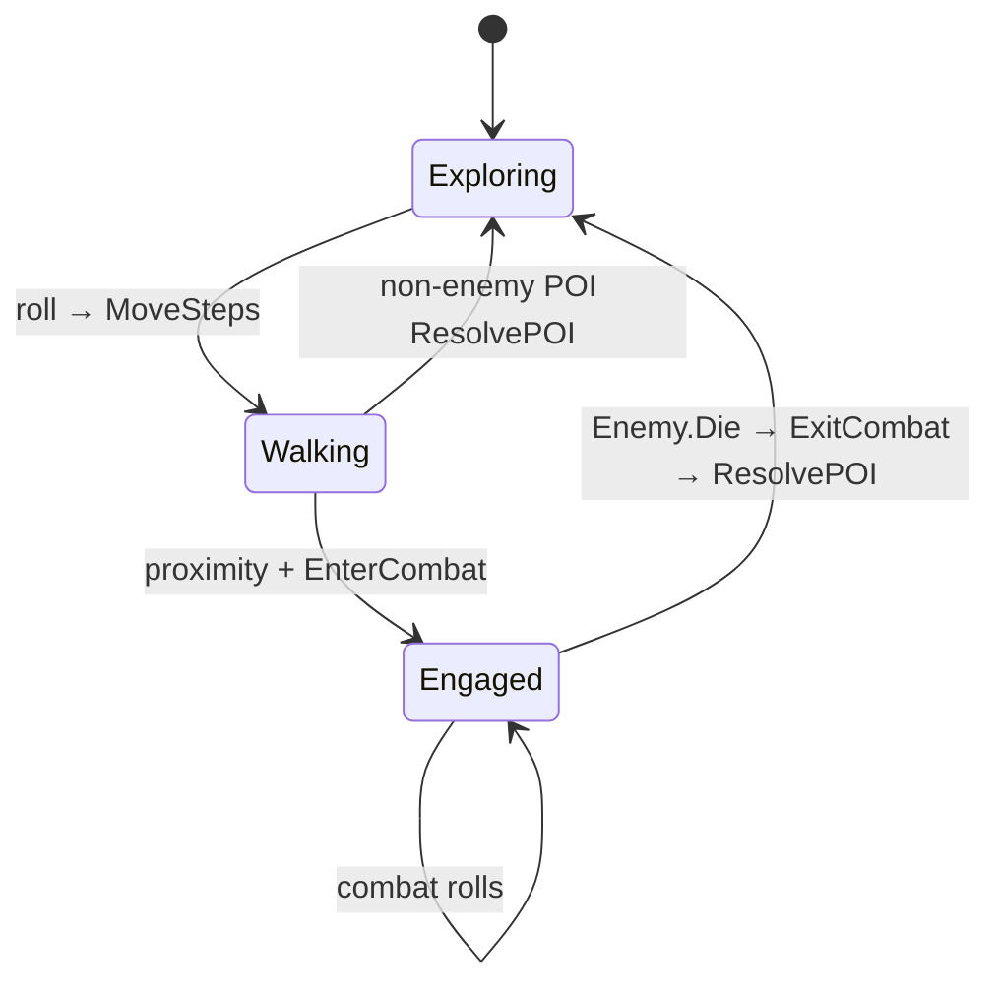

---

## 8. Enemy AI

`Enemy.HandleAI()` each frame while alive.

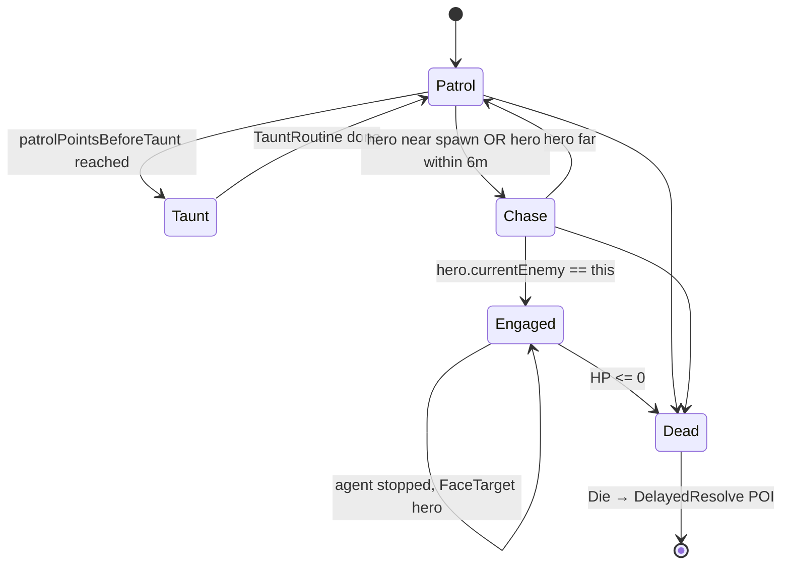

| State | Behavior |
|--------|----------|
| **Patrol** | Random NavMesh points within `patrolRadius` of `spawnPosition` |
| **Taunt** | `Taunting` trigger, ~2.2s, sets `isAttacking` |
| **Chase** | `SetDestination(hero)`, `chaseSpeed` |
| **Engaged** | Stop agent, slerp face toward Steve |

---

## 9. POI lifecycle

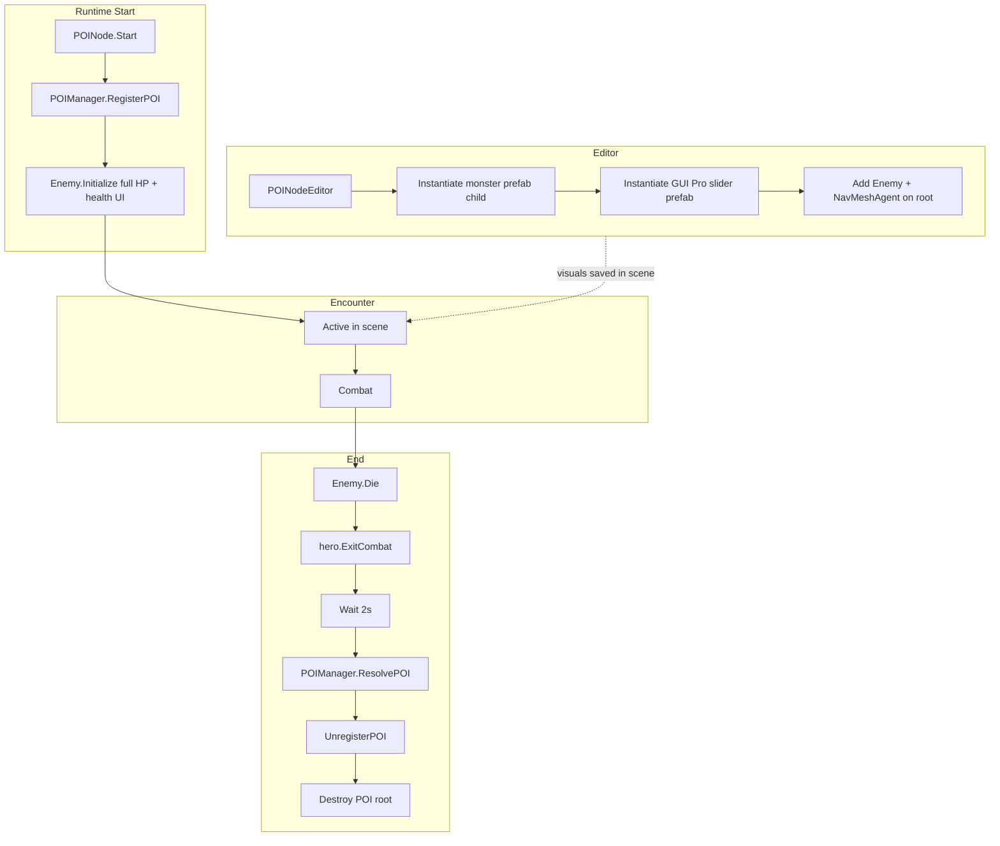

**`POINode` root structure (typical)**

```
POI_Orc (POINode, Enemy, NavMeshAgent, tag=POI)
├── OrcPBRDefault (animator mesh child)
└── Slider_Border_Tapered_02_Green (world-space Canvas)
    ├── Bg / Border / Fill Area / Fill
```

---

## 10. Editor vs runtime (POI setup)

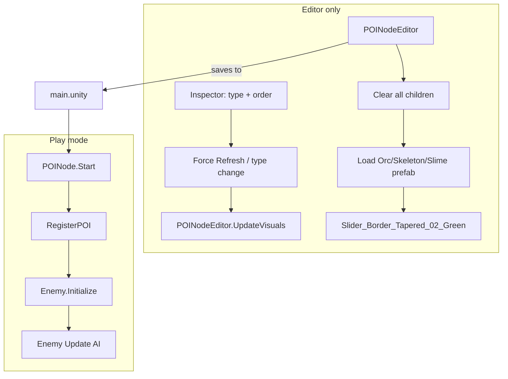

| Concern | Editor | Play mode |
|---------|--------|-----------|
| Monster mesh | `POINodeEditor` spawns prefab | Already in scene |
| Health bar | Editor positions at +2.8y | `LateUpdate` pins at +3.0y world, billboards |
| Stats | `Enemy` inspector / `OnValidate` | `Initialize()` sets HP = maxHP |

---

## 11. Stats and damage formulas

Shared RPG formulas on **hero** (`PlayerStats`) and **enemy** (`Enemy`).

| Derived stat | Formula |
|--------------|---------|
| maxHP | `vitality × 10 + 100` |
| attackDamage | `strength × 4 + 20` |
| attackSpeed | `1.0 + agility × 0.03` |
| critChance (%) | `luck × 0.8` |
| critDamage (%) | `50 + luck × 1.5` |
| dodgeChance (%) | `agility × 0.6` |

**Damage applications**

| Source | Formula |
|--------|---------|
| Arrival hit | `leftoverDice × leftoverStepDamageMultiplier + AttackDamage × 0.5` (+ crit) |
| Combat roll | `AttackDamage × (roll / 7)` (+ crit) |
| Enemy hit | `attackDamage` (+ crit); hero dodges via `PlayerStats` |

`GlobalSettings.heroMaxHP`, `orcStartHP`, `combatDamageMultiplier` are **legacy/unused** — tune `PlayerStats` / `Enemy` instead.

---

## 12. UI and health bars

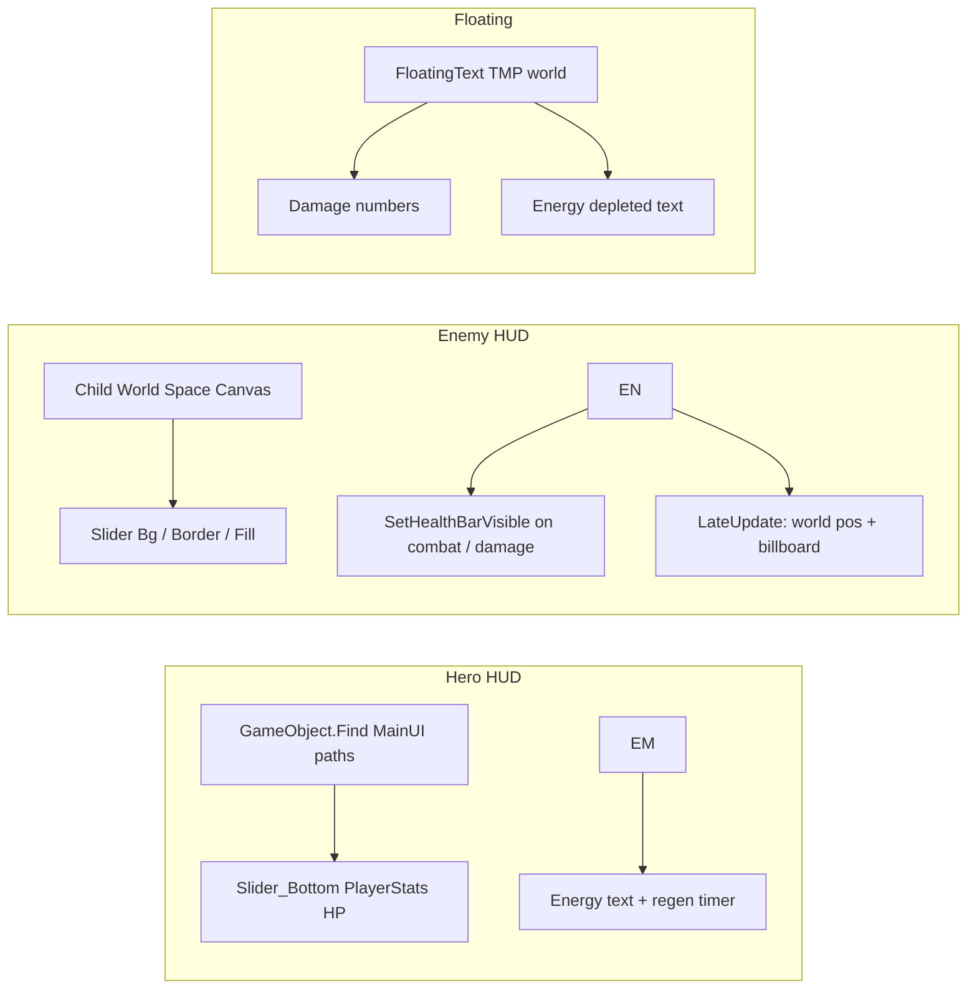

---

## 13. Repo, version, and README automation

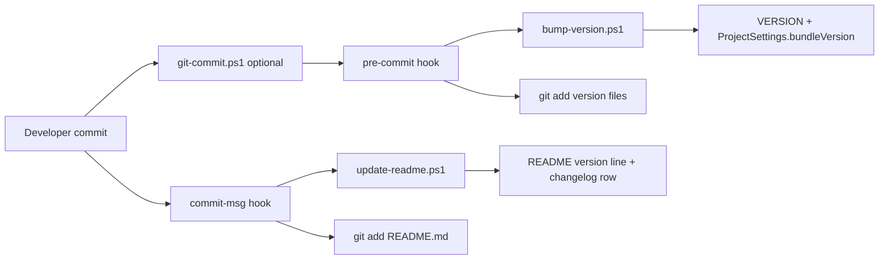

Files:

| Path | Role |
|------|------|
| `VERSION` | `v0.0.XXX` tag string |
| `scripts/bump-version.ps1` | Increment patch |
| `scripts/update-readme.ps1` | Sync README from commit subject |
| `scripts/git-commit.ps1` | `git -c core.hooksPath=.githooks commit` |
| `.githooks/pre-commit` | Version bump |
| `.githooks/commit-msg` | README update |

---

## 14. Script index

| Script | Responsibility |
|--------|----------------|
| `DiceSpawner` | Input, roll physics, energy, branch move vs combat |
| `DieResult` | Dice face value + settled detection |
| `HeroController` | NavMesh move, POI target, arrival combat, hero HP HUD |
| `PlayerStats` | Hero primary/derived stats, dodge |
| `Enemy` | Enemy stats, AI, HP bar, damage, death |
| `EnemyData` | ScriptableObject template (**runtime wiring pending**) |
| `POINode` | POI tag, type, visit `order`, register/init enemy |
| `POIManager` | POI list, resolve, nearest/random/order query |
| `POINodeEditor` | Editor prefab + health bar setup |
| `GlobalSettings` | Tunable singleton |
| `EnergyManager` | Energy pool + UI |
| `LevelManager` | XP + level UI |
| `FloatingText` | World TMP popups |
| `QADashboard` | Debug HUD for roll/distance |
| `QAVersionDisplay` / `GitVersionProvider` | Build version overlay |
| `CameraFollow` | Camera follow Steve |
| `UIButtonHoldProxy` / `UIPressedEffect` | UI feedback |

---

## Related docs

- [README.md](../README.md) — setup, play instructions, changelog, troubleshooting
- [VERSION](../VERSION) — current patch label
